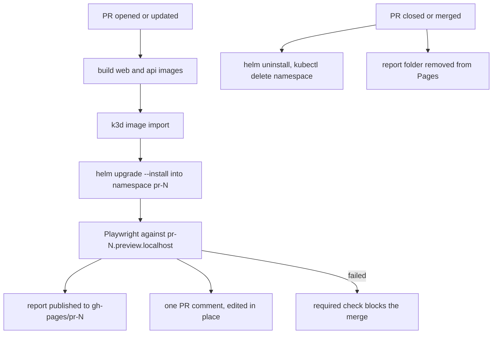

# pr-preview-environments

Every pull request gets its own environment. When a PR is opened or pushed to, CI
builds the frontend and the API, deploys them with Helm into a namespace called
`pr-<number>` on a k3d cluster, runs Playwright against that namespace through its
own ingress host, and leaves a single comment on the PR with the result and a link
to the HTML report. Later pushes edit that same comment instead of adding new ones.
When the PR is closed or merged, the namespace and the published report are removed.
It runs on GitHub-hosted runners and a local k3d cluster, so there is no cloud
account and no bill.



## Quickstart

Needs `docker`, `k3d`, `kubectl`, `helm`, Python 3.14 and Node.js 24 (versions in
`apps/api/.python-version` and `.nvmrc`). `brew install k3d helm` covers the cluster
side. Deploying a preview needs none of the language runtimes locally, they are only
for running the tests and the linter yourself.

```bash
make cluster-up
make preview PR=42        # build, import, deploy into namespace pr-42
make e2e-install          # once, downloads the chromium build
make e2e PR=42
```

`make api-install` creates the virtualenv for `make test` and `make lint`.

The environment is then at http://pr-42.preview.localhost:8080, and a second one
lives next to it as soon as you run `make preview PR=43`. `make preview-list` shows
what is running, `make preview-down PR=42` removes one, `make cluster-down` removes
the cluster.

`*.localhost` resolves to the loopback address on macOS and on systemd hosts. If
yours does not, add `127.0.0.1 pr-42.preview.localhost` to `/etc/hosts`. If port
8080 is taken, change it in `k3d/cluster.yaml` and pass `PREVIEW_PORT` to the
scripts.

## The two clusters

The scripts and the chart do not care where the cluster came from, which is what
makes both halves work.

In CI the job creates a k3d cluster, deploys `pr-<N>` into it, tests it and deletes
the cluster. Nothing survives the run, so a fork of this repository gets working
previews with no setup at all.

On a long-lived cluster, your laptop or a self-hosted runner, the namespaces
accumulate one per open PR and stay reachable until the PR closes. Add a base64
`PREVIEW_KUBECONFIG` secret to point CI at such a cluster and the cleanup workflow
will delete the namespace there too. Without the secret it only removes the
published report, because the namespace died with its runner.

`make preview-reap` deletes the environments whose pull request is no longer open,
which is the safety net for a laptop that was offline when a PR got merged.

## What CI does

`.github/workflows/pr-preview.yml` runs on `opened`, `synchronize` and `reopened`:

1. `unit` runs pytest, ruff, `helm lint` and `helm template`.
2. `preview` creates the cluster, deploys `pr-<N>`, runs Playwright, uploads the
   report as an artifact, publishes it to `gh-pages/pr-<N>/` and writes the comment.

A failing run still publishes the report and writes the comment before the job
fails, which is when you actually want to read the report. Concurrency is keyed on
the PR number, so a new push cancels the run still in flight.

`.github/workflows/pr-cleanup.yml` runs on `closed` and removes the report folder,
the namespace (when a kubeconfig is configured) and rewrites the comment.

Pull requests from forks get a read-only token, so the publish and comment steps are
skipped for them. The tests themselves still run and still gate the merge.

## Blocking merges on the check

Turn on GitHub Pages (Settings → Pages → branch `gh-pages`) for the report links,
then make the `preview` job required:

```bash
gh api -X PUT repos/OWNER/REPO/branches/main/protection --input - <<'EOF'
{
  "required_status_checks": { "strict": true, "contexts": ["preview"] },
  "enforce_admins": false,
  "required_pull_request_reviews": null,
  "restrictions": null
}
EOF
```

## No secrets

There are none in the repository and none needed to run it. Images are built on the
runner and loaded straight into the cluster with `k3d image import`, so there is no
registry and no pull secret. Comments and the `gh-pages` push use the `GITHUB_TOKEN`
that GitHub issues for the run. The only optional secret is `PREVIEW_KUBECONFIG`,
and only if you want CI to reach a long-lived cluster.

## Layout

```
apps/api            FastAPI app: /api/healthz, /api/readyz, /api/items, /api/version
apps/web            static page on nginx, reads everything from the API
charts/preview-app  one release per pull request: web, api, ingress
e2e                 Playwright specs and config
scripts             deploy, destroy, list, comment, publish - shared by make and CI
k3d/cluster.yaml    the local and CI cluster
```

Three languages, on purpose. Python holds the API and the scripts that have logic to
speak of: reading the Playwright report, finding and editing the PR comment, pushing
the report to `gh-pages`. Bash stays where the work is a short sequence of `docker`,
`kubectl` and `helm` calls, because wrapping those in `subprocess.run` buys nothing.
JavaScript only runs in the browser and in the Playwright specs.

Versions are pinned everywhere: actions by commit SHA, k3d and k3s by tag, base
images by exact tag, Python dependencies by `==`, and the e2e `package-lock.json` is
committed.
